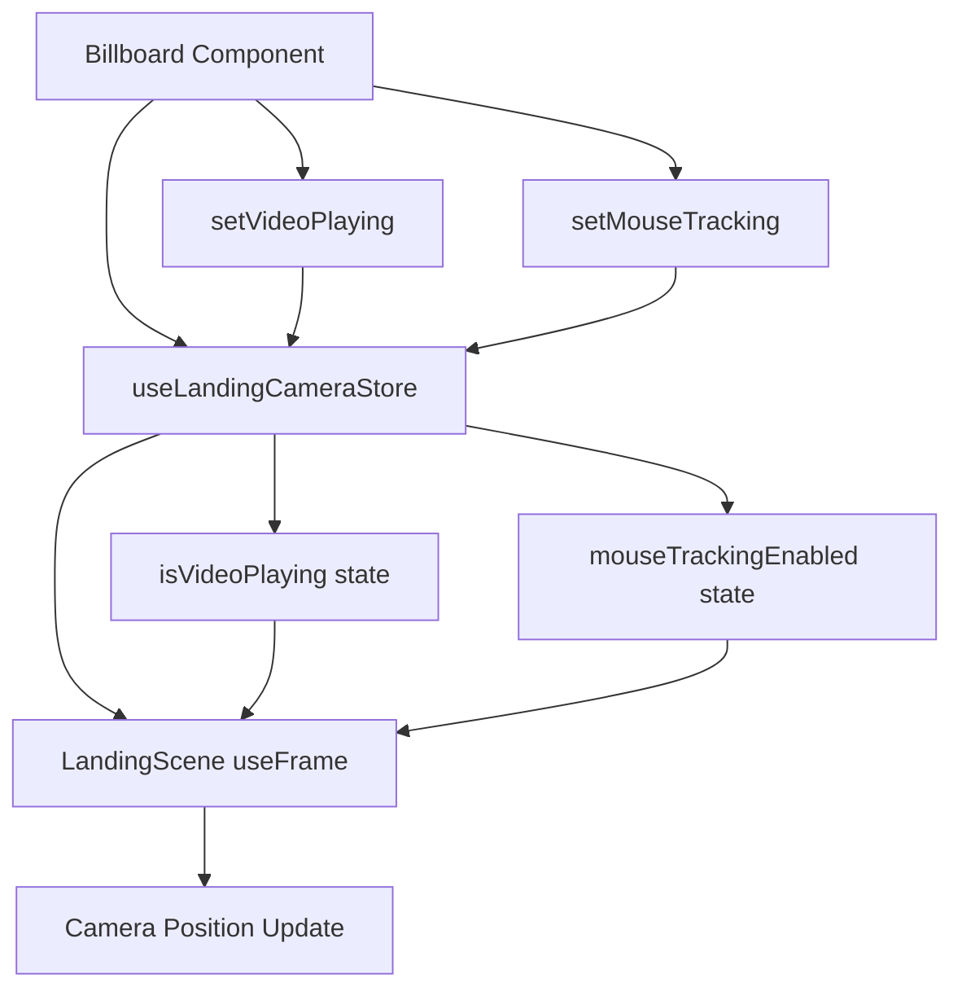

# Mouse Tracking & Video Player Integration

## Overview

The billboard video player now integrates seamlessly with the landing scene's mouse tracking system, providing smooth transitions and proper event handling without disrupting the camera experience.

## 🎯 Problems Solved

### ❌ **Before: Issues**

- Video player UI was not interactive (couldn't click controls)
- Mouse tracking caused jarring camera jumps when video started
- Billboard hover interfered with camera mouse tracking
- Portal pointer events conflicted with 3D scene interactions
- No coordination between video state and camera system

### ✅ **After: Solutions**

- Video player UI fully interactive with proper event isolation
- Smooth camera transitions when entering/exiting video mode
- Coordinated mouse tracking that gracefully reduces during video playback
- Clean event separation between 3D scene and HTML elements
- Centralized state management for video and camera coordination

## 🏗️ Architecture

### **State Management Flow**



### **Extended Camera Store**

```typescript
interface LandingCameraStore {
  // Existing state
  position: Vector3;
  target: Vector3;
  isAnimating: boolean;
  hasAnimated: boolean;

  // New video integration state
  isVideoPlaying: boolean; // Tracks video player state
  mouseTrackingEnabled: boolean; // Controls mouse tracking

  // New actions
  setVideoPlaying: (isPlaying: boolean) => void;
  setMouseTracking: (enabled: boolean) => void;
}
```

## 🎮 Mouse Tracking Enhancements

### **Smooth Transition Logic**

```typescript
// Enhanced useFrame in LandingScene
useFrame((state, delta) => {
  // Calculate damping with video considerations
  let dampingMultiplier = 1;

  if (isHoveringUI.current) {
    dampingMultiplier = MOUSE_CONFIG.uiDampingFactor; // 0.8
  }

  // Gradual reduction during video playback
  if (isVideoPlaying) {
    dampingMultiplier *= 0.1; // Much stronger damping
  }

  // Smooth return to center when disabled
  if (!mouseTrackingEnabled) {
    dampingMultiplier = 0.02; // Very slow return
    mousePosition.current.x = 0; // Target center
    mousePosition.current.y = 0;
  }

  // Apply smooth camera updates
  const targetInfluence = mouseTrackingEnabled ? currentConfig.mouseInfluence : 0;
  // ... smooth camera position updates
});
```

### **Transition States**

1. **Normal Mode**: Full mouse tracking active
2. **Video Hover**: Reduced tracking (existing UI damping)
3. **Video Playing**: Heavily damped tracking (10% influence)
4. **Video UI Focus**: Disabled tracking with smooth return to center

## 🎬 Video Player Integration

### **Event Flow**

```typescript
// Billboard component event handlers
const handlePlayClick = useCallback(
  event => {
    event?.stopPropagation(); // Prevent R3F event bubbling

    if (mode === 'texture') {
      setMode('player');
      setVideoPlaying(true); // Notify camera system
      setMouseTracking(false); // Smooth camera return
    }
  },
  [mode, setVideoPlaying, setMouseTracking]
);

const handleClosePlayer = useCallback(() => {
  setMode('texture');
  setVideoPlaying(false); // Restore normal camera behavior
  setMouseTracking(true); // Re-enable mouse tracking
}, [setVideoPlaying, setMouseTracking]);
```

### **Portal Management**

```typescript
// Enhanced portal interactivity
useEffect(() => {
  const container = portalRef?.current;
  if (!container) return;

  if (mode === 'player' || mode === 'fullscreen') {
    container.style.pointerEvents = 'auto'; // Enable interaction
    container.style.zIndex = '50'; // Ensure top layer
  } else {
    container.style.pointerEvents = 'none'; // Disable when not needed
    container.style.zIndex = '40'; // Lower priority
  }
}, [mode, portalRef]);
```

### **Event Isolation**

```tsx
// Video player containers prevent event bubbling
<div
  className="relative bg-black"
  style={{ pointerEvents: 'auto' }}
  onPointerDown={e => e.stopPropagation()} // Block R3F
  onPointerUp={e => e.stopPropagation()}
  onPointerMove={e => e.stopPropagation()}
  onClick={e => e.stopPropagation()}
>
  <MuxPlayer {...props} />
  {/* Interactive controls */}
</div>
```

## 🎯 User Experience Flow

### **Smooth Transition Sequence**

1. **User hovers billboard** → Mouse tracking reduces to 80% (existing UI damping)
2. **User clicks play button** → Video mode activates, mouse tracking reduces to 10%
3. **Camera smoothly returns to center** → Gradual movement over ~2-3 seconds
4. **Video player becomes interactive** → Portal events enabled, UI fully functional
5. **User closes video** → Mouse tracking re-enables, camera responds normally

### **No Jarring Effects**

- ✅ Camera doesn't snap to position
- ✅ Smooth exponential transitions
- ✅ Configurable damping factors
- ✅ Maintains visual continuity

## 🛠️ Configuration Options

### **Mouse Tracking Settings**

```typescript
// In mouseConfig.ts
export const MOUSE_CONFIG = {
  influence: 1.5, // Base mouse influence
  dampingFactor: 0.05, // Base damping
  uiDampingFactor: 0.8, // UI hover damping
  videoDampingFactor: 0.1, // Video active damping (new)
  returnDampingFactor: 0.02, // Disabled return damping (new)
} as const;
```

### **Leva Debug Controls**

- **Camera Settings**: Position, target, mouse influence, damping
- **Player Settings**: Position, rotation, scale, dimensions
- **Debug Controls**: Enable/disable debug mode
- All controls work together seamlessly

## 🧪 Testing & Validation

### **Manual Testing Checklist**

- [ ] Billboard hover shows play button without camera jumps
- [ ] Clicking play button smoothly transitions camera
- [ ] Video player controls are fully interactive
- [ ] Fullscreen mode works properly
- [ ] Closing video restores mouse tracking smoothly
- [ ] No event conflicts between 3D scene and HTML elements
- [ ] Leva controls work for real-time adjustments

### **Performance Validation**

- [ ] No unnecessary re-renders
- [ ] Smooth 60fps camera transitions
- [ ] Proper event delegation
- [ ] Memory cleanup on component unmount

## 🔧 Debugging

### **Common Issues & Solutions**

**Video player not interactive:**

- Check portal `pointerEvents` in browser dev tools
- Verify z-index layering
- Ensure event propagation is stopped on player containers

**Jarring camera movements:**

- Adjust damping factors in `MOUSE_CONFIG`
- Check video state synchronization
- Verify smooth transition logic in `useFrame`

**Event conflicts:**

- Use `stopPropagation()` on all player event handlers
- Check portal container event capture
- Verify R3F event system integration

## 🚀 Performance Benefits

- **Optimized Re-renders**: Store updates only trigger necessary components
- **Smooth Animations**: Exponential damping for natural camera movement
- **Event Efficiency**: Proper event delegation prevents conflicts
- **Memory Management**: Clean state management with proper cleanup

This integration maintains the high-quality user experience while providing full video functionality without compromising the existing mouse tracking system.
